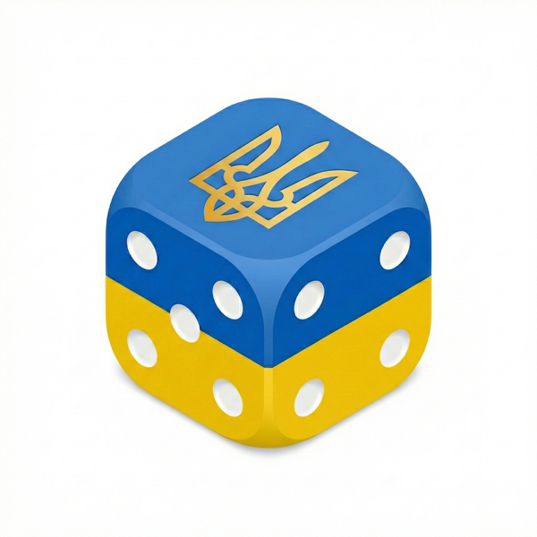

# Donation Raffle Bot

<p align="center">
  
</p>

Donation Raffle Bot is a Telegram bot for group chats that turns friendly donation challenges into a quick raffle. Participants register (or get auto-registered by chatting), and the bot picks a random winner with a suggested donation amount.

## Setup

1. Create a bot with BotFather and copy the token.
2. Install dependencies:

```bash
npm install
```

3. Copy `.env.example` to `.env` and fill in values.

```bash
cp .env.example .env
```

## Cloudflare Tunnel (Webhook)

Telegram webhooks require HTTPS. You can use Cloudflare Tunnel for local development:

```bash
npx cloudflared tunnel --url http://localhost:3000
```

Set `PUBLIC_URL` to the HTTPS URL printed by the tunnel command.

## Run

```bash
npm start
```

## Migrations

Migrations run automatically on startup. You can also run them manually:

```bash
npm run migrate
```

Create a new migration file with:

```bash
npm run migrate:make add_new_table
```

Database selection:

- If `DATABASE_URL` is set, the bot uses PostgreSQL.
- If `DATABASE_URL` is not set, the bot uses SQLite at `SQLITE_PATH`.

## Tests

```bash
npm test
```

### PostgreSQL tests (Docker)

Spin up PostgreSQL with Docker Compose:

```bash
docker-compose up -d postgres
```

Run the test suite against PostgreSQL:

```bash
npm run test:pg
```

Clean up the container:

```bash
docker-compose down
```

## Commands

- `/register` - Register yourself (private or group chats).
- `/eject` - Remove yourself from the registry.
- `/list` - List registered users for the current chat.
- `/configure` - Configure jar link, donation limits, triggers, auto-register, or schedule.
- `/raffle` - Start the countdown and pick a random registered user (group chats only).
- `/cancel` - Cancel an active raffle.
- `/help` - Show command list.
- `/help schedule` - Show schedule format help.
- `/stats` - Show top 10 winners.
- `/info` - Short bot info.

## Features

- Group raffles with countdown messages and random winner selection.
- Automatic registration when users post in group chats (toggle with `/configure auto-register on|off`).
- Scheduled raffles configured with `/configure schedule`.
- `/eject` opt-out support for auto-registration.
- Per-group configuration via `/configure`.
- Winner stats with total donated amounts.

## Configuration

- `BOT_TOKEN` - Telegram bot token (required).
- `PUBLIC_URL` - HTTPS base URL for webhook (required).
- `WEBHOOK_PATH` - webhook path, default `/telegram-webhook`.
- `PORT` - server port, default `3000`.
- `JAR_URL` - default donation jar URL (required).
- `SQLITE_PATH` - SQLite storage path, default `./data/registry.sqlite`.
- `DATABASE_URL` - PostgreSQL connection string (optional). When set, PostgreSQL is used instead of SQLite.

## Notes

- For auto-register on any group message, disable BotFather Privacy Mode so the bot receives all messages.

## License

MIT. You can copy, modify, and deploy your own version of this bot.
